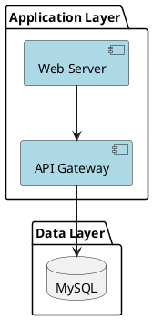
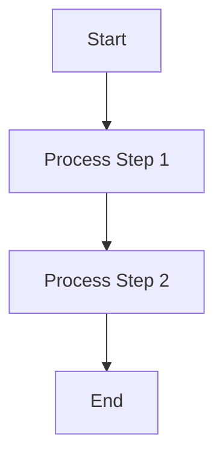

# Claude Code Global Configuration

## Shell Environment
- User shell: zsh (not bash)
- **CRITICAL**: The Bash tool has issues with scm_breeze aliases in the current session. When using commands that may trigger aliases (especially `ls`), you MUST use one of these approaches:
  1. Use absolute paths: `/bin/ls` instead of `ls`
  2. Wrap in zsh: `zsh -c "ls -la"` instead of `ls -la`
  3. Use alternative tools: `Glob` for finding files instead of `ls`
- Always use zsh-compatible syntax when running shell commands
- For `ls` commands specifically, ALWAYS use `/bin/ls` with absolute path

## Development Environment
- Platform: macOS (Darwin)
- Default terminal: zsh

## Diagram Format Standards

### General Rules
When creating diagrams in documentation, ALWAYS follow these format rules:

1. **Architecture Diagrams**: Use PlantUML
   - System architecture diagrams
   - Component relationship diagrams
   - Deployment topology diagrams
   - Package/Module diagrams

2. **Flow and Sequence Diagrams**: Use Mermaid
   - Business process flows
   - Data flow diagrams
   - Sequence diagrams (interaction/call sequences)
   - State diagrams
   - Gantt charts
   - Entity-relationship diagrams
   - Class diagrams (if needed)

### PlantUML Guidelines

**Use Cases:**
- System architecture showing layers and components
- Deployment diagrams with servers and infrastructure
- Component relationships and dependencies

**Example:**

### Mermaid Diagram Generation

When generating Mermaid diagrams, ALWAYS follow these rules to avoid syntax errors:

**Syntax Rules:**

1. **Node IDs**: Use simple alphanumeric identifiers without dots, dashes in node IDs
   - ✓ Good: `A`, `B1`, `step1`, `nodeA`
   - ✗ Bad: `10.2.3`, `node-1`, `step.1`

2. **Node Labels**: Use quotes for labels containing special characters, spaces, or version numbers
   - ✓ Good: `A["Version 10.2.3"]`, `B["Step 1: Initialize"]`
   - ✗ Bad: `A[Version 10.2.3]` (may cause parsing issues)

3. **Arrow Syntax**: Use standard arrow syntax
   - ✓ Good: `A --> B`, `A -.-> B`, `A ==> B`
   - Avoid complex custom styling unless necessary

4. **Graph Direction**: Always specify at the start
   - Use: `graph TD`, `graph LR`, `flowchart TD`, etc.

**Example Template:**

**Version-specific Notes:**
- When showing version numbers (like 10.2.3), ALWAYS use them in quoted labels, NEVER as node IDs
- Keep node IDs simple: `v1`, `v2`, `v3` instead of `10.2.3`, `10.2.4`

**Common Diagram Types:**

- **Flowchart**: `graph TD` or `flowchart TD`
- **Sequence Diagram**: `sequenceDiagram`
- **State Diagram**: `stateDiagram-v2`
- **Entity Relationship**: `erDiagram`
- **Gantt Chart**: `gantt`